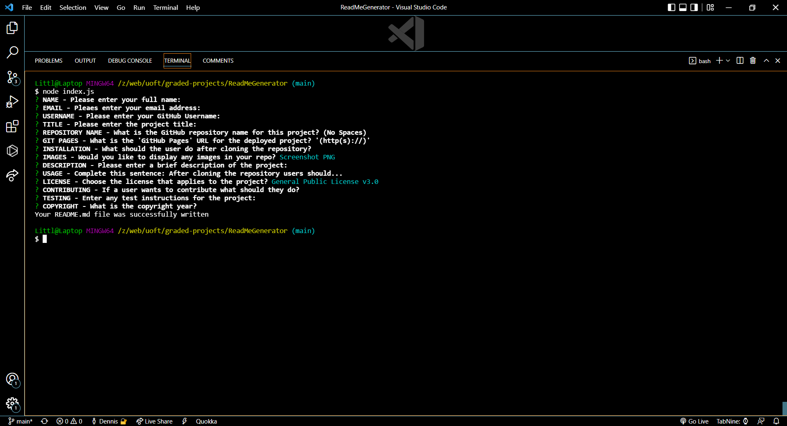

# README Generator

## Table of Contents
- [Description](#description)
- [Installation](#installation)
- [Usage](#usage)
- [Application](#application)
- [images](#images)
- [Tests](#tests)
- [questions](#questions)
- [Contributing](#contributing)
- [License](#license)
- [Copyright](#copyright)

## Description
README Generator will help you develop fast efficient readme's without all the fuss.

## Installation

Follow these steps to install this project on your local machine.
- Open Bash editor
- mkdir ReadMe-Generator
- cd ReadMe-Generator
- git clone https://github.com/GitHub/ReadMe-Generator
- npm install

## Usage
After cloning this repository To use this project
Email me

## Application
Link to Deployed Application: none

## Images

## Tests
Email me

## Questions
- Username: GitHub
- GitHub: https://github.com/GitHub/
- Email: none@none.com

## Contributing
Email me

## License

- ## License
   This project is licenses under the General Public License v3.0 license.
-  - [License: GNU Affero General Public License v3.0](https://www.gnu.org/licenses/gpl-3.0) 

##Copyright
(c) Copyright 2022 Full Stack
    